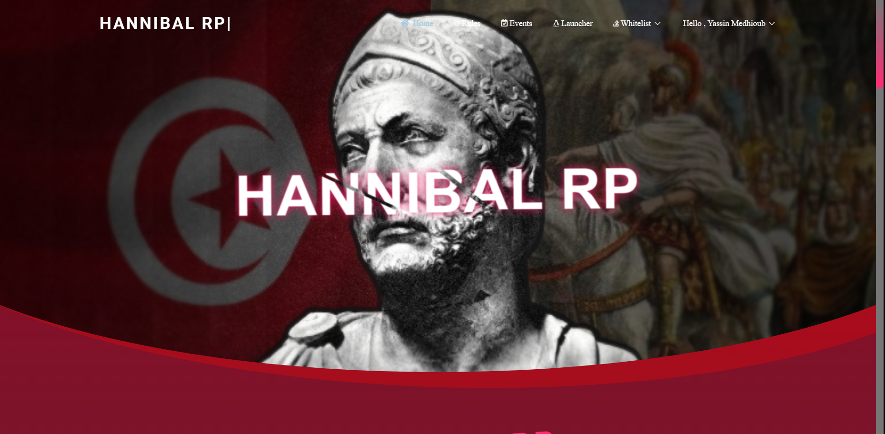
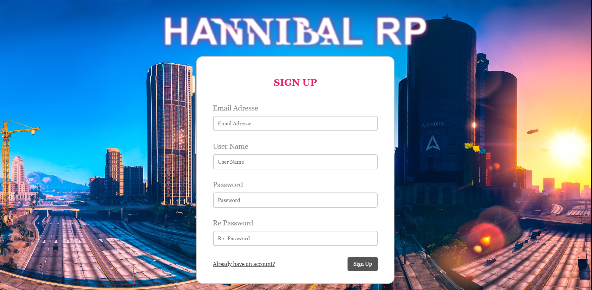
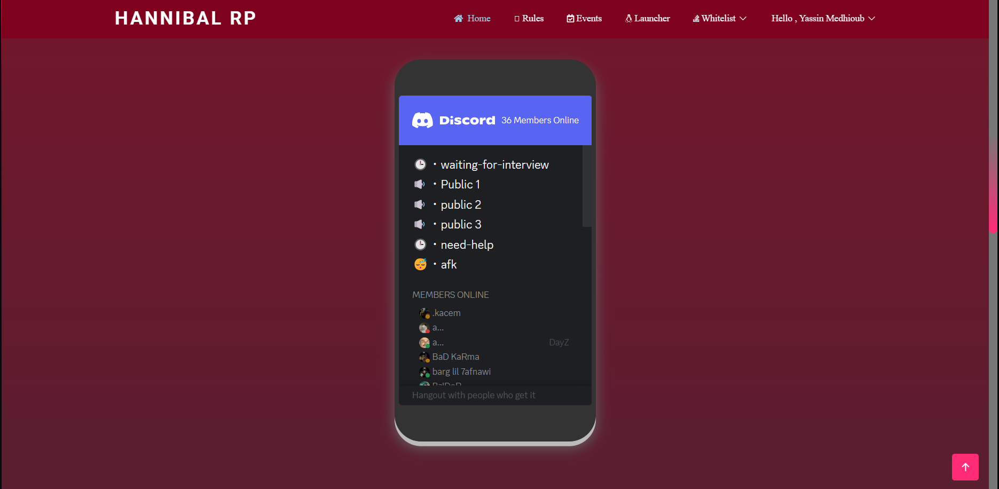
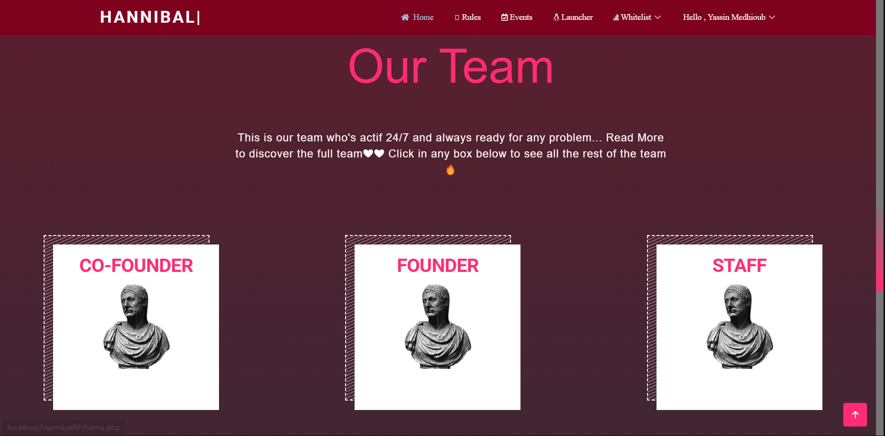
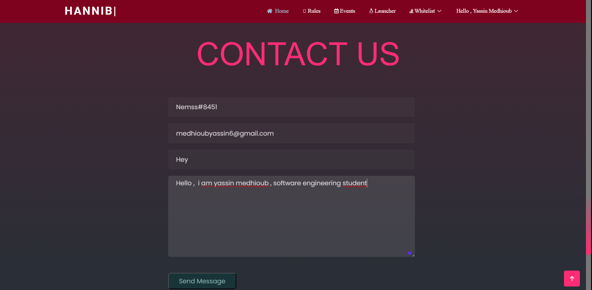
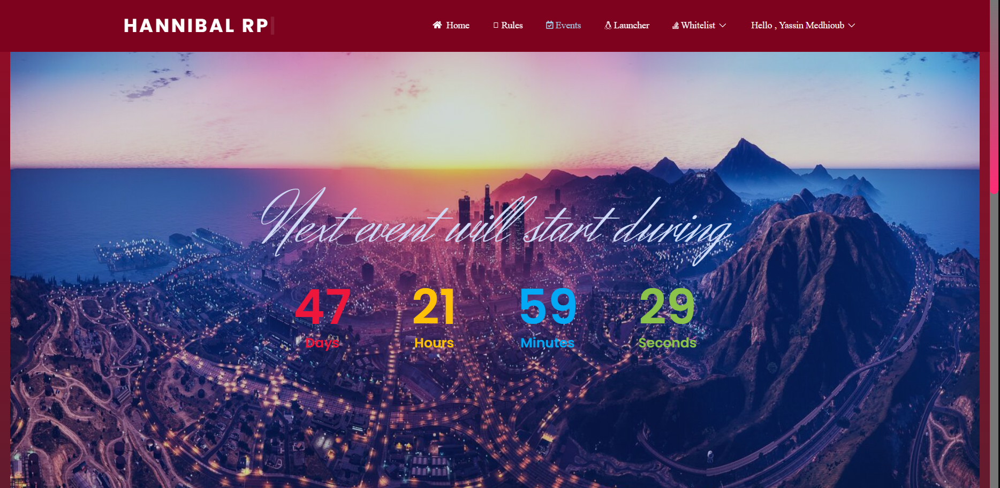
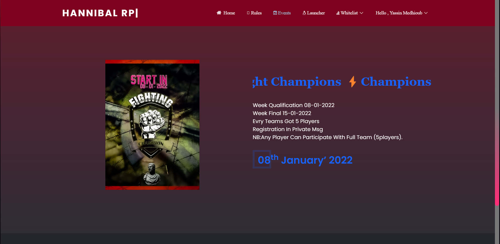
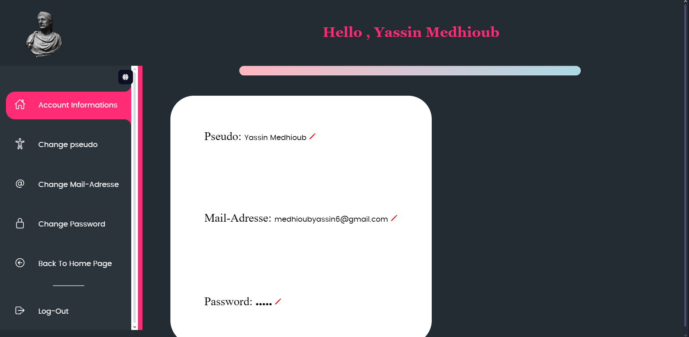

# 🌆 Hannibal RP - GTA RP Server Website

A fully functional web portal built for a **GTA Roleplay (RP) server** community. This website serves as the central hub for players to manage their accounts, stay updated on server events, connect with the Discord server, and engage with the staff team.

---

## 🚀 Features

- 📝 **User Authentication**
  - Register, login, logout
  - Manage profile: change username and password

- 💬 **Contact the Team**
  - Send messages directly to server admins/staff via a contact form

- 📢 **Events Section**
  - View **upcoming** events and browse through **past** ones

- 👨‍👩‍👧‍👦 **The Team Page**
  - Meet the admins, moderators, and key community members

- 📜 **Rules Page**
  - Display the official server rules to maintain order and roleplay quality

- 🔗 **Discord Integration**
  - View and join the official Discord server straight from the website

---

## 📸 Screenshots













---

## 🎥 Demo Video

🎬 *Watch how the app works in real-time*  
👉 [Watch the video](https://www.linkedin.com/posts/yassin-medhioub_webdevelopment-gta5rp-fullstackdevelopment-activity-7339562277144002560-Knij?utm_source=social_share_send&utm_medium=member_desktop_web&rcm=ACoAADXWTVgBrSW5LkeqY476dil9ccfS6_2mAtQ)

## 🛠️ Tech Stack

- **Frontend:** HTML, CSS, JavaScript , Bootstrap
- **Backend:** PHP 
- **Database:** MySQL 
- **Other:** Discord Widget 

---

## 🧑‍💻 Setup & Installation

1. **Clone the repository**

   ```bash
   git clone https://github.com/YassinMedhioub/Hannibal-RP.git
   cd Hannibal-RP
